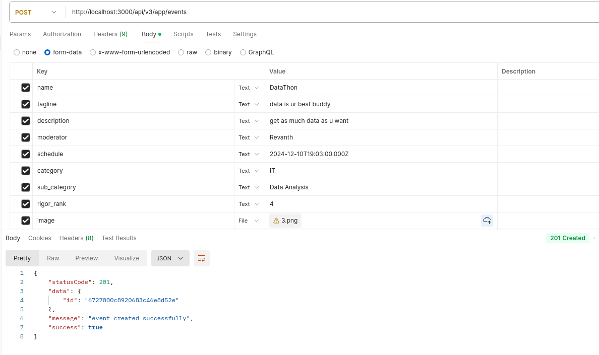
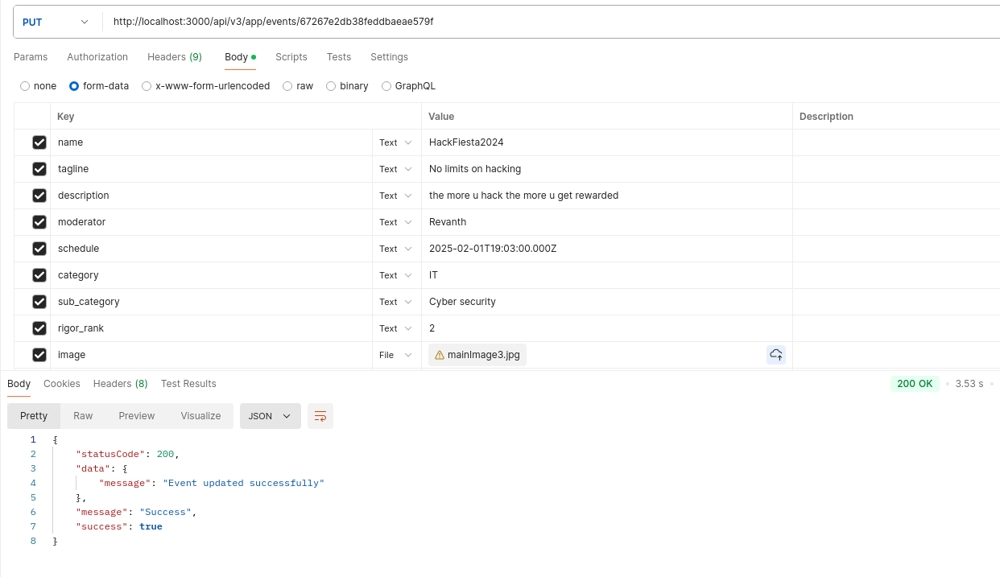

# Task1 Project Documentation

## Overview

Task1 is a backend application built with Node.js. It is designed to manage event-related operations such as creating, updating, deleting, and fetching events. The project includes database connectivity, routing, middleware, and controller logic.

## Folder Structure

```
src/
|-- app.js
|-- config/
|   |-- db.js
|-- controllers/
|   |-- event.controller.js
|-- middlewares/
|   |-- errorHandler.middleware.js
|   |-- multer.middleware.js
|-- routes/
|   |-- event.route.js
|-- services/
|   |-- event.service.js
|-- utils/
|   |-- ApiError.js
|   |-- ApiResponse.js
|   |-- asyncHandler.js
|   |-- cloudinary.js
```

## Setup

### Prerequisites

- Node.js
- npm (Node Package Manager)
- MongoDB

### Installation

1. Clone the repository:

   ```sh
   git clone https://github.com/Revanth221/dt_backend.git
   cd dt_backend/task1
   ```

2. Install the dependencies:

   ```sh
   npm install
   ```

3. Create a `.env` file in the root directory and add the following environment variables:
   ```sh
   PORT=3000
   MONGODB_URI=your_mongodb_uri
   CLOUDINARY_CLOUDNAME=your_cloudinary_cloudname
   CLOUDINARY_API_KEY=your_cloudinary_apikey
   CLOUDINARY_API_SECRET=your_cloudinary_apisecret
   ```

### Running the Application

Start the server:

```sh
npm start
```

The server will run on `http://localhost:3000`.

## API Testing with Postman

<
<
<
<

## API Endpoints

### Event Routes

- **GET /api/v3/app/events**: Fetch all events or a specific event by ID.
- **POST /api/v3/app/events**: Create a new event (with image upload).
- **PUT /api/v3/app/events/:id**: Update an existing event by ID (with image upload).
- **DELETE /api/v3/app/events/:id**: Delete an event by ID.

## Key Files

### app.js

The main entry point of the application. It sets up the Express server, connects to the database, initializes services, and defines routes and middleware.

### event.route.js

Defines the routes related to event operations and uses the respective controller functions to handle requests.

### event.controller.js

Contains the logic for handling event-related operations such as fetching, creating, updating, and deleting events. It utilizes services and middleware for database interactions and error handling.

## Middleware

- **errorHandler.middleware.js**: Handles errors and sends appropriate responses.
- **multer.middleware.js**: Handles file uploads using Multer.

## Services

- **event.service.js**: Contains business logic for event operations and interacts with the database.

## Utilities

- **ApiError.js**: Defines custom API error responses.
- **ApiResponse.js**: Defines custom API success responses.
- **asyncHandler.js**: Handles asynchronous operations and errors.
- **cloudinary.js**: Handles image uploads to Cloudinary.
